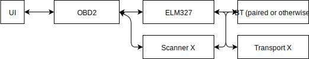

# OBD2 scan tool library

* Bluetooth Component
  * Communicates with OS bluetooth and passes messages
  * Returns error when connection severed 
* ELM327 Component
  * Implements communication with ELM327
  * Passthrough for OBD2 / watching the bus
  * Fake ELM327 component for testing
* OBD2 Component
* UI Component

## References
https://www.elmelectronics.com/wp-content/uploads/2016/07/ELM327DS.pdf
